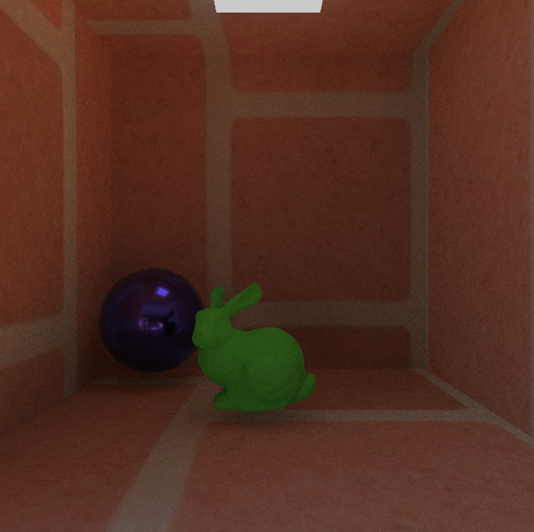

# Learning OpenGL...

- [x] Getting Started
- [x] Lighting
- [x] Model Loading
- [x] Advanced OpenGL
- [x] Advanced Lighting
- [x] PBR
- [x] In_Practice

Now this is a GPU-based path tracer.


## Features
- load textures
- BVH
- BRDF
- importance sampling

## Material(.mtl)
- Kd(diffuse, base color)
- Ks(specular)
- Ke(emissive)
- Ns(shineness, roughness = 1 - shineness / 1000)
- Pm(metallic)
- Ni(refracti)
- d(opacity)

## Run
```
mkdir build && cd build
cmake ..
make
cd ../bin
./main
```